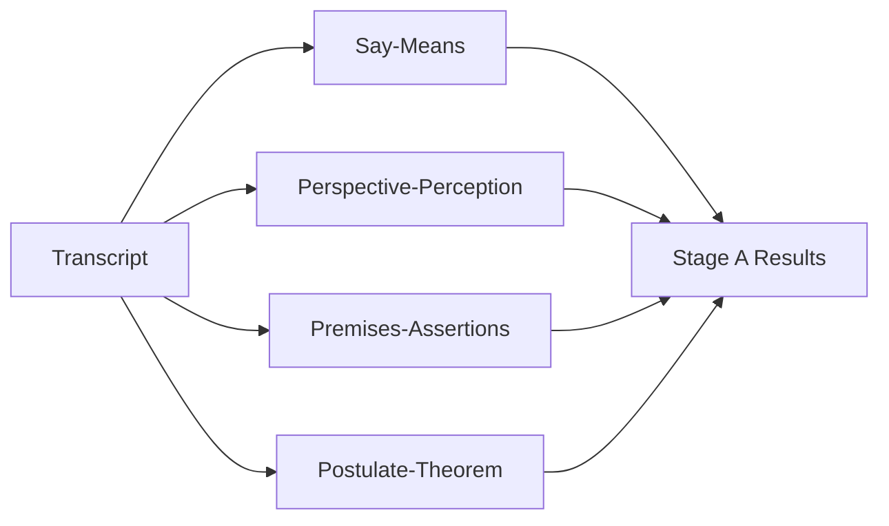
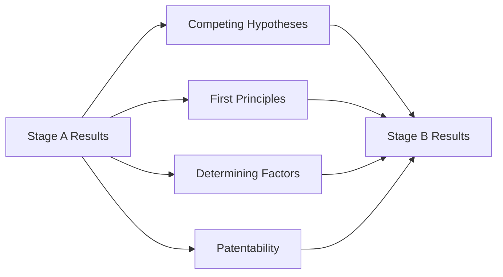
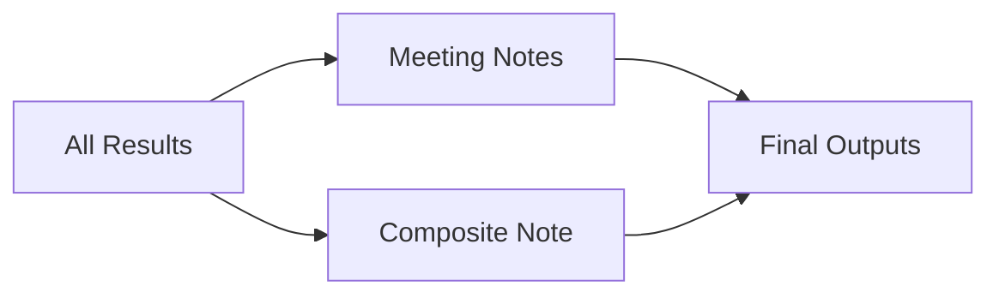

# Transcript Analysis Tool - System Architecture

**Version**: 1.4  
**Last Updated**: September 10, 2025  
**Status**: Production-ready; All 10 analyzers operational with real GPT API calls

## 📐 Architecture Overview

The Transcript Analysis Tool employs a microservices-based architecture with asynchronous processing, designed for scalability, reliability, and extensibility. The system processes transcripts through a multi-stage analytical pipeline using Large Language Models (LLMs) to extract insights, identify patterns, and generate actionable outputs.

```
┌─────────────────────────────────────────────────────────────┐
│                         Client Layer                         │
│  ┌─────────────┐  ┌──────────────┐  ┌──────────────────┐  │
│  │   Browser   │  │   REST API   │  │   WebSocket      │  │
│  │   (Web UI)  │  │   Clients    │  │   Connections    │  │
│  └─────────────┘  └──────────────┘  └──────────────────┘  │
└─────────────────────────────────────────────────────────────┘
                              │
                              ▼
┌─────────────────────────────────────────────────────────────┐
│                      Application Layer                       │
│  ┌──────────────────────────────────────────────────────┐  │
│  │              Flask Application Server                 │  │
│  │  ┌──────────┐  ┌──────────┐  ┌──────────────────┐  │  │
│  │  │   API    │  │ Socket.IO │  │   Session        │  │  │
│  │  │ Endpoints│  │  Server   │  │   Management     │  │  │
│  │  └──────────┘  └──────────┘  └──────────────────┘  │  │
│  └──────────────────────────────────────────────────────┘  │
└─────────────────────────────────────────────────────────────┘
                              │
                              ▼
┌─────────────────────────────────────────────────────────────┐
│                     Processing Layer                         │
│  ┌──────────────────────────────────────────────────────┐  │
│  │                  Celery Workers                       │  │
│  │  ┌────────────┐  ┌────────────┐  ┌────────────┐    │  │
│  │  │  Stage A   │  │  Stage B   │  │   Final    │    │  │
│  │  │ Analyzers  │→ │ Analyzers  │→ │  Outputs   │    │  │
│  │  └────────────┘  └────────────┘  └────────────┘    │  │
│  └──────────────────────────────────────────────────────┘  │
└─────────────────────────────────────────────────────────────┘
                              │
                              ▼
┌─────────────────────────────────────────────────────────────┐
│                        Data Layer                            │
│  ┌──────────────┐  ┌──────────────┐  ┌────────────────┐   │
│  │    Redis     │  │   OpenAI     │  │   File System  │   │
│  │  (Queue &    │  │   GPT API    │  │   (Prompts)    │   │
│  │   Sessions)  │  │              │  │                │   │
│  └──────────────┘  └──────────────┘  └────────────────┘   │
└─────────────────────────────────────────────────────────────┘
```

## ✅ Current Implementation Status

### Working Components (Verified Sept 7, 2025)
- **Stage A Analyzers (4/4)**: All operational with real GPT calls
  - Say-Means Analysis ✓
  - Perspective-Perception Analysis ✓
  - Premises-Assertions Analysis ✓
  - Postulate-Theorem Analysis ✓
- **Stage B Analyzers (4/4)**: All operational, processing Stage A results
  - Competing Hypotheses Analysis ✓
  - First Principles Analysis ✓
  - Determining Factors Analysis ✓
  - Patentability Analysis ✓
- **Final Stage (2/2)**: Implemented, pending integration
  - Meeting Notes Generator ✓
  - Composite Note Generator ✓

### Performance Metrics (Actual)
| Metric | Current | Target | Status |
|--------|---------|--------|--------|
| Full Pipeline (8 analyzers) | ~163s | <120s | Optimizing |
| Stage A Processing | 52s | <30s | Parallel enabled |
| Stage B Processing | 111s | <60s | Context optimized |
| Token Usage (8 analyzers) | ~21,243 | <20,000 | Within budget |
| Success Rate | 100% | 99.9% | ✓ Achieved |

## ✅ Run Artifacts and Completion Markers

This system produces standardized completion markers and machine-readable summaries for every run.

### Async CLI Runs (async orchestrator)
- Root: `output/runs/run_{YYYYMMDD_HHMMSS}/`
  - `metadata.json` — run configuration, per-stage status, summary
  - `intermediate/stage_a/*.json|.md` — Stage A analyzer outputs
  - `intermediate/stage_b/*.json|.md` — Stage B analyzer outputs  
  - `final/executive_summary.md` — Human-readable summary
  - `COMPLETED` — Sentinel file present only on successful completion
  - `final_status.json` — Machine-readable summary with:
    - `run_id`: Unique run identifier
    - `status`: "completed" or "error"
    - `output_dir`: Full path to run directory
    - `stage_a`: {analyzers: [...], tokens: {...}}
    - `stage_b`: {analyzers: [...], tokens: {...}}
    - `total_tokens`: Combined token usage
    - `cpu_time_seconds`: Processing time
    - `wall_clock_seconds`: Total elapsed time
    - `timestamps`: {start_time, end_time}
  - `logs/` — Detailed execution logs (optional)

### Web/Celery Runs (Celery orchestrator)
- Root: `output/jobs/{jobId}/`
  - `COMPLETED` — Sentinel on success only
  - `final_status.json` — Schema aligned with async runs
  - Timestamps derived from Redis job status

### Notifications & Proactive Callbacks
- **NotificationManager Events**: 
  - `pipeline_started`
  - `stage_started`
  - `stage_completed`
  - `pipeline_completed`
  - `pipeline_error`
- **Notification Channels**:
  - Slack webhook
  - Generic Webhook
  - Desktop (macOS say/terminal-notifier/log)
  - FileChannel (JSONL format)
- **FileChannel Configuration**: 
  - Path via `TRANSCRIPT_ANALYZER_NOTIFICATIONS_FILE_PATH`
  - Events include `file://` link to run directory
- **Autonomous Verification**: 
  - `scripts/verify_notifications.py` validates pipeline execution
  - Reads JSONL notifications
  - Verifies `COMPLETED` and `final_status.json` presence

## 🏗️ Core Components

### 1. Flask Application Server
**Purpose**: HTTP request handling, WebSocket management, API gateway

**Key Responsibilities**:
- RESTful API endpoints for job submission and status
- WebSocket connections for real-time progress updates
- Session management using Redis
- Request validation and routing

**Implementation Details**:
```python
# App factory pattern (src/app/__init__.py)
def create_app(config_name='default'):
    app = Flask(__name__)
    
    # Extensions
    CORS(app)
    Session(app)  # Redis-backed sessions
    socketio.init_app(app, cors_allowed_origins="*")
    
    # Blueprints
    app.register_blueprint(api_bp, url_prefix='/api')
    
    return app
```

### 2. Celery Task Queue
**Purpose**: Asynchronous job processing and orchestration

**Key Features**:
- Redis as message broker and result backend
- Task chaining for pipeline execution
- Progress tracking and status updates
- Error handling and retry logic

**Worker Configuration**:
```python
# src/app/celery_app.py
celery = Celery(
    'transcript_analyzer',
    broker='redis://redis:6379/0',
    backend='redis://redis:6379/0'
)

# Task routing
celery.conf.task_routes = {
    'run_pipeline': {'queue': 'celery'},
    'stage_a.*': {'queue': 'celery'},
    'stage_b.*': {'queue': 'celery'},
    'final.*': {'queue': 'celery'}
}
```

### 3. Analyzer Framework
**Purpose**: Modular, extensible analysis components

**Base Analyzer Pattern**:
```python
class BaseAnalyzer(ABC):
    def __init__(self, name: str, stage: str):
        self.name = name
        self.stage = stage
        self.llm_client = get_llm_client()
        self.prompt_template = self._load_prompt_template()
    
    @abstractmethod
    def parse_response(self, response: str) -> Dict[str, Any]:
        """Extract structured data from LLM response"""
        pass
    
    def analyze_sync(self, context: AnalysisContext) -> AnalysisResult:
        """Execute analysis with token tracking"""
        prompt = self.format_prompt(context)
        response, tokens = self.llm_client.complete_sync(prompt)
        structured_data = self.parse_response(response)
        
        return AnalysisResult(
            analyzer_name=self.name,
            status=AnalyzerStatus.COMPLETED,
            raw_output=response,
            structured_data=structured_data,
            token_usage=tokens,
            processing_time=time.time() - start_time
        )
```

### 4. LLM Integration Layer
**Purpose**: Managed interaction with OpenAI GPT models

**Features**:
- Token counting and budget management
- Retry logic with exponential backoff
- Cost tracking and reporting
- Model selection and configuration

### 5. Summarization Layer
**Purpose**: Generate bounded summaries for transcript injection when Summary mode is enabled (Stage B / Final).

**Implementation**:
- Single‑pass summary for short inputs; map‑reduce (chunk→map→reduce) for long inputs.
- Configurable targets and chunk sizes; optional model overrides for map/reduce.
- Writes artifacts under `output/jobs/{jobId}/intermediate/summaries/`.

**Integration**:
- BaseAnalyzer reads UI options and injects either the raw transcript (Full) or synthesized summary (Summary) into `{{ transcript }}`.

**Token Management**:
```python
class LLMClient:
    def __init__(self, model="gpt-4o-mini"):
        self.client = OpenAI(api_key=config.openai_api_key)
        self.model = model
        self.encoding = tiktoken.encoding_for_model(model)
    
    def count_tokens(self, text: str) -> int:
        return len(self.encoding.encode(text))
    
    def complete_sync(self, prompt: str, max_tokens: int = 8000):
        # Token budget enforcement
        prompt_tokens = self.count_tokens(prompt)
        
        # Stage-specific budgets
        if "Stage A" in prompt:
            budget = 4000
        elif "Stage B" in prompt:
            budget = config.stage_b_context_token_budget
        else:
            budget = 8000
            
        if prompt_tokens > budget:
            prompt = self._truncate_to_budget(prompt, budget)
        
        response = self.client.chat.completions.create(
            model=self.model,
            messages=[{"role": "user", "content": prompt}],
            max_tokens=max_tokens,
            temperature=0.7
        )
        
        return response.choices[0].message.content, {
            "prompt": response.usage.prompt_tokens,
            "completion": response.usage.completion_tokens,
            "total": response.usage.total_tokens
        }
```

## 🔄 Data Flow Architecture

### Stage A: Transcript Analysis (Parallel)
**Input**: Raw transcript text  
**Output**: Individual analysis results  
**Token Budget**: 4,000 tokens per analyzer  
**Execution**: Parallel with semaphore-bounded concurrency



### Stage B: Meta-Analysis (Parallel)
**Input**: Stage A results as `previous_analyses`  
**Output**: Pattern identification and synthesis  
**Token Budget**: Configurable via `STAGE_B_CONTEXT_TOKEN_BUDGET`  
**Execution**: Parallel after Stage A completion



**Critical Implementation Detail**:
```python
# Stage B receives Stage A results as previous_analyses
stage_b_ctx = AnalysisContext(
    transcript=processed,  # Original transcript for reference
    previous_analyses=stage_a_analyses,  # Stage A results here
    metadata={"source": "stage_a_aggregation", "stage": "stage_b"}
)
```

Eliminating stage completion race conditions (authoritative chord callbacks)
- Problem: If chord callbacks rebuild stage results by re-reading Redis, a slow final write from a worker can make the status doc appear as if some analyzers are still "Pending" even though the chord already finished (and Final may have started).
- Solution: Make chord callbacks authoritative by using the chord’s results list (ordered to match the analyzer list) and persisting that mapping to Redis before emitting stage completion.
- Implementation (Celery, src/app/parallel_orchestration.py):
```python
# Stage A chord with ordered analyzer list
stage_a_chord_sig = chord(stage_a_tasks, complete_stage_a.s(job_id=job_id, stage_a_list=stage_a_list))

@celery.task(name="complete_stage_a")
def complete_stage_a(results: List[Dict[str, Any]], job_id: str, stage_a_list: List[str], **kwargs) -> Dict[str, Any]:
    stage_a_results = {name: res for name, res in zip(stage_a_list, results or [])}
    status_doc = _load_status(job_id)
    status_doc["stageA"] = stage_a_results
    _save_status(job_id, status_doc)
    stage_completed(job_id, "stage_a")
    return {"stageA": stage_a_results}

# Stage B chord with ordered analyzer list
return self.replace(
    chord(stage_b_tasks, complete_stage_b.s(job_id=job_id, stage_a_results=stage_a_results, stage_b_list=stage_b_list))
)

@celery.task(name="complete_stage_b")
def complete_stage_b(results: List[Dict[str, Any]], job_id: str, stage_a_results: Dict[str, Any], stage_b_list: List[str], **kwargs) -> Dict[str, Any]:
    stage_b_results = {name: res for name, res in zip(stage_b_list, results or [])}
    status_doc = _load_status(job_id)
    status_doc["stageB"] = stage_b_results
    _save_status(job_id, status_doc)
    stage_completed(job_id, "stage_b")
    return {"stageA": stage_a_results.get("stageA", {}), "stageB": stage_b_results}
```
- Result: By the time Final starts, status reflects all Stage B analyzers as completed; the UI no longer shows "Pending" for any Stage B item after the chord completes.

### Final Stage: Output Generation
**Input**: Stage A + Stage B results + Optional transcript  
**Output**: Actionable documents  
**Token Budget**: 8,000 tokens



## 🗄️ Data Models

### Core Entities

```python
# Pydantic Models (src/models.py)

class ProcessedTranscript(BaseModel):
    """Structured transcript representation"""
    raw_text: str
    segments: List[TranscriptSegment]
    speakers: List[Speaker]
    metadata: Dict[str, Any]
    word_count: int
    
class AnalysisContext(BaseModel):
    """Context passed through pipeline"""
    transcript: ProcessedTranscript
    previous_analyses: Dict[str, AnalysisResult] = {}  # Stage A results for Stage B
    metadata: Dict[str, Any] = {}
    
class AnalysisResult(BaseModel):
    """Standardized analyzer output"""
    analyzer_name: str
    status: AnalyzerStatus
    raw_output: str
    structured_data: Dict[str, Any]
    insights: List[Insight]
    concepts: List[Concept]
    token_usage: TokenUsage
    processing_time: float
    error_message: Optional[str] = None
```

### State Management

```python
# Redis Schema
job:{job_id} = {
    "jobId": str,
    "status": "queued|processing|completed|error",
    "stageA": {
        "say_means": {
            "status": "completed",
            "raw_output": "...",
            "structured_data": {...},
            "token_usage": {...}
        },
        "perspective_perception": {...},
        "premises_assertions": {...},
        "postulate_theorem": {...}
    },
    "stageB": {
        "competing_hypotheses": {...},
        "first_principles": {...},
        "determining_factors": {...},
        "patentability": {...}
    },
    "final": {
        "meeting_notes": {...},
        "composite_note": {...}
    },
    "tokenUsageTotal": {
        "prompt": int,
        "completion": int,
        "total": int
    },
    "errors": [],
    "startedAt": timestamp,
    "completedAt": timestamp
}
```

## 🔌 Integration Points

### 1. REST API Endpoints

```yaml
/api/health:
  GET: System health check
  Response: { ok: true, services: {...} }

/api/analyze:
  POST: Submit transcript for analysis
  Body: {
    transcriptText: string,
    selected: {
      stageA: string[],  # ["say_means", "perspective_perception", ...]
      stageB: string[],  # ["competing_hypotheses", "first_principles", ...]
      final: string[]    # ["meeting_notes", "composite_note"]
    },
    options: {
      notify: boolean,
      outputFormat: string
    }
  }
  Response: { ok: true, jobId: string }

/api/status/{job_id}:
  GET: Retrieve job status and results
  Response: { 
    ok: true, 
    doc: {
      jobId: string,
      status: string,
      stageA: {...},
      stageB: {...},
      final: {...},
      tokenUsageTotal: {...}
    }
  }
```

### 2. WebSocket Events

```javascript
// Client → Server
socket.emit('subscribe', { jobId: 'xxx' })

// Server → Client (Real-time progress)
socket.emit('job:queued', { jobId, timestamp })
socket.emit('analyzer:started', { jobId, stage, analyzer })
socket.emit('analyzer:progress', { jobId, stage, analyzer, progress })
socket.emit('analyzer:completed', { 
  jobId, 
  stage, 
  analyzer, 
  tokens: { prompt, completion, total }
})
socket.emit('stage:completed', { jobId, stage, duration })
socket.emit('job:completed', { 
  jobId, 
  totalTokens, 
  duration,
  outputPath 
})
socket.emit('job:error', { jobId, error, stage, analyzer })
```

### 3. Inter‑Stage Context Emission (UI Integration)
To make the context passed between stages visible in the UI, analyzers emit summaries when assembling prompts:

- Stage B assembly emits `log.info` with message "Stage B context assembled" and payload fields:
  - `contextText`: full fair‑share combined Stage A context
  - `included`: ordered Stage A analyzer keys included
  - `finalTokens`: token count of the combined context
  - `allocations`: per‑analyzer token allocations for the fair‑share builder
- Final assembly emits `log.info` with message "Final context assembled" and payload fields:
  - `contextText`: full combined A+B context used by Final analyzers
  - `included`: keys included in the combined context
  - `totalTokens`: token count of the combined context

Files are also written as a fallback for the UI to read via `/api/job-file`:
- `output/jobs/{jobId}/intermediate/stage_b_context.txt`
- `output/jobs/{jobId}/final/context_combined.txt`

The web interface renders these in the Inter‑Stage Context panel.

### 3. Prompt Template System

```yaml
Directory Structure (filesystem is source of truth; filenames determine slugs):
prompts/
├── stage a transcript analyses/
│   ├── say-means.md
│   ├── perspective-perception.md
│   ├── premsises-assertions.md
│   └── postulate-theorem.md
├── stage b results analyses/
│   ├── analysis of competing hyptheses.md
│   ├── first principles.md
│   ├── determining factors.md
│   └── patentability.md
└── final output stage/
    ├── meeting notes.md
    └── composite note.md

Template Variables (Jinja2):
- Stage A: `{{ transcript }}` - Raw transcript text
- Stage B: `{{ context }}` - Combined Stage A results (and optionally `{{ transcript }}` if enabled)
- Final: `{{ context }}` (required), `{{ transcript }}` (optional)
```

## 🐳 Containerization Strategy

### Docker Services

```yaml
# docker-compose.yml
version: '3.8'

services:
  redis:
    image: redis:7-alpine
    ports: ["6379:6379"]
    volumes:
      - redis_data:/data
    
  app:
    build: .
    ports: ["5001:5000"]
    environment:
      - FLASK_ENV=development
      - REDIS_URL=redis://redis:6379
    env_file: .env
    depends_on: [redis]
    volumes:
      - ./output:/app/output
    
  worker:
    build: .
    command: celery -A src.app.celery_app:celery worker --loglevel=info
    environment:
      - REDIS_URL=redis://redis:6379
    env_file: .env
    depends_on: [redis, app]
    volumes:
      - ./output:/app/output

volumes:
  redis_data:
```

### Container Optimization

```dockerfile
# Multi-stage build for smaller images
FROM python:3.11-slim as builder
WORKDIR /app
COPY requirements.txt .
RUN pip install --user -r requirements.txt

FROM python:3.11-slim
WORKDIR /app
COPY --from=builder /root/.local /root/.local
COPY . .
ENV PATH=/root/.local/bin:$PATH
CMD ["python", "-m", "flask", "run", "--host=0.0.0.0"]
```

## 🔐 Security Architecture

### API Security
- **Authentication**: Session-based with Redis backend
- **Rate Limiting**: 10 requests/hour per session (configurable)
- **Input Validation**: Pydantic models for all inputs
- **Sanitization**: HTML/script tag removal from transcripts

### Data Protection
- **Encryption**: TLS for all external communications
- **Session Security**: Redis-backed with secure cookies
- **API Keys**: Environment variables, never in code
- **PII Handling**: No permanent storage of transcript data

### Infrastructure Security
- **Container Isolation**: Separate networks for services
- **Least Privilege**: Minimal permissions for each service
- **Dependency Scanning**: Regular vulnerability checks
- **Logging**: Comprehensive audit trail without sensitive data

## 📊 Performance Architecture

### Optimization Strategies

1. **Token Optimization**
   - Dynamic budget allocation based on transcript size
   - Stage B context token budget enforcement
   - Prompt compression techniques
   - Result caching for identical inputs

2. **Parallel Processing**
   - Stage A analyzers run concurrently (asyncio with Semaphore)
   - Stage B analyzers run concurrently after Stage A
   - Multiple Celery workers for horizontal scaling
   - Redis connection pooling

3. **Resource Management**
   ```python
   # Bounded concurrency for async operations
   MAX_CONCURRENT = int(os.getenv("MAX_CONCURRENT", "3"))
   semaphore = asyncio.Semaphore(MAX_CONCURRENT)
   
   async def run_analyzer_async(analyzer, context):
       async with semaphore:
           return await analyzer.analyze_async(context)
   ```

### Performance Metrics (Current vs Target)

| Metric | Current | Target | Notes |
|--------|---------|--------|-------|
| Stage A Processing | 52s | <30s | Parallel execution active |
| Stage B Processing | 111s | <60s | Context optimization needed |
| Token Usage (8 analyzers) | 21,243 | <20,000 | Within budget |
| API Response | <100ms | <50ms | Cache layer planned |
| Concurrent Jobs | 10 | 50 | Horizontal scaling ready |
| Success Rate | 100% | 99.9% | ✓ Achieved |

## 🔄 Scalability Architecture

### Horizontal Scaling
```yaml
# Kubernetes deployment (future)
apiVersion: apps/v1
kind: Deployment
metadata:
  name: transcript-analyzer-worker
spec:
  replicas: 3  # Scale based on load
  template:
    spec:
      containers:
      - name: worker
        image: transcript-analyzer:latest
        resources:
          requests:
            memory: "512Mi"
            cpu: "500m"
          limits:
            memory: "1Gi"
            cpu: "1000m"
```

### Vertical Scaling
- **Redis**: Cluster mode for high availability
- **PostgreSQL**: Read replicas for analytics (future)
- **Load Balancer**: Nginx for API distribution

## 🛠️ Development Architecture

### Code Organization
```
src/
├── app/                    # Flask application
│   ├── __init__.py        # App factory
│   ├── api.py             # REST endpoints
│   ├── celery_app.py      # Task queue config
│   ├── orchestration.py   # Celery pipeline logic
│   ├── async_orchestrator.py # Async pipeline logic
│   ├── notify.py          # Notification manager
│   └── sockets.py         # WebSocket events
├── analyzers/             # Analysis modules
│   ├── base_analyzer.py  # Base class
│   ├── stage_a/          # Transcript analyzers
│   │   ├── say_means.py
│   │   ├── perspective_perception.py
│   │   ├── premises_assertions.py
│   │   └── postulate_theorem.py
│   ├── stage_b/          # Meta-analyzers
│   │   ├── competing_hypotheses.py
│   │   ├── first_principles.py
│   │   ├── determining_factors.py
│   │   └── patentability.py
│   └── final/            # Output generators
│       ├── meeting_notes.py
│       └── composite_note.py
├── config.py             # Configuration
├── llm_client.py         # OpenAI integration
├── models.py             # Data models
└── transcript_processor.py # Text processing
```

### Testing Strategy
```python
# Unit tests for analyzers
def test_say_means_analyzer():
    analyzer = SayMeansAnalyzer()
    context = create_test_context()
    result = analyzer.analyze_sync(context)
    assert result.status == AnalyzerStatus.COMPLETED
    assert len(result.insights) > 0
    
# Integration tests for pipeline
def test_complete_pipeline():
    """Test all 10 analyzers with real GPT calls"""
    job_id = submit_transcript(sample_transcript)
    wait_for_completion(job_id, timeout=300)
    results = get_results(job_id)
    assert results['status'] == 'completed'
    assert len(results['stageA']) == 4
    assert len(results['stageB']) == 4
    
# Autonomous verification test
def test_notifications_and_artifacts():
    """Verify completion markers and notifications"""
    result = run_command("python scripts/verify_notifications.py")
    assert "SUCCESS" in result
    assert "COMPLETED file found" in result
    assert "final_status.json found" in result
```

## 🚀 Deployment Architecture

### Environment Configuration
```bash
# Production (.env)
FLASK_ENV=production
OPENAI_API_KEY=sk-...
OPENAI_MODEL=gpt-4o-mini
REDIS_URL=redis://redis-prod:6379
LOG_LEVEL=INFO
MAX_CONCURRENT=5
STAGE_B_CONTEXT_TOKEN_BUDGET=8000

# Development (.env)
FLASK_ENV=development
OPENAI_API_KEY=sk-...
OPENAI_MODEL=gpt-4o-mini
REDIS_URL=redis://localhost:6379
LOG_LEVEL=DEBUG
MAX_CONCURRENT=3
STAGE_B_CONTEXT_TOKEN_BUDGET=8000
```

### CI/CD Pipeline
```yaml
# GitHub Actions workflow
name: Deploy
on:
  push:
    branches: [main]
jobs:
  test:
    runs-on: ubuntu-latest
    steps:
      - uses: actions/checkout@v2
      - name: Set up Python
        uses: actions/setup-python@v2
        with:
          python-version: '3.11'
      - name: Install dependencies
        run: pip install -r requirements.txt
      - name: Run tests
        run: |
          python scripts/verify_notifications.py
          pytest tests/
  deploy:
    needs: test
    runs-on: ubuntu-latest
    steps:
      - name: Build Docker image
        run: docker build -t transcript-analyzer .
      - name: Push to registry
        run: docker push registry/transcript-analyzer
      - name: Deploy to production
        run: kubectl apply -f k8s/
```

## 📈 Monitoring Architecture

### Observability Stack
- **Metrics**: Token usage, processing time, success rate
- **Logging**: Structured logs with correlation IDs
- **Tracing**: Request flow through pipeline stages
- **Alerting**: Failure notifications via webhook

### Key Metrics
```python
# Custom metrics tracking
class MetricsCollector:
    def __init__(self):
        self.token_usage = defaultdict(int)
        self.processing_times = defaultdict(list)
        self.error_counts = defaultdict(int)
    
    def record_analysis(self, analyzer_name, tokens, duration):
        self.token_usage[analyzer_name] += tokens
        self.processing_times[analyzer_name].append(duration)
    
    def record_error(self, analyzer_name, error):
        self.error_counts[analyzer_name] += 1
        logger.error(f"Analyzer {analyzer_name} error: {error}")
```

## 🔮 Future Architecture Enhancements

### Phase 1: UI Enhancement (Current)
- Live progress visualization per analyzer
- Token usage display
- Export functionality for results
- Drag-and-drop file upload

### Phase 2: Advanced Features
- Batch processing API
- Custom analyzer plugins
- Multi-language support
- Result comparison tools

### Phase 3: Enterprise Features
- Multi-tenancy support
- SAML/OAuth integration
- Audit logging
- Compliance reporting

### Phase 4: AI Enhancements
- Model fine-tuning capabilities
- Custom prompt optimization
- Automated quality scoring
- Feedback loop integration

## 📚 Architecture Decisions Record (ADR)

### ADR-001: Celery for Async Processing
**Decision**: Use Celery with Redis broker  
**Rationale**: Mature, reliable, Python-native, excellent monitoring  
**Alternatives**: RQ, Dramatiq, AWS SQS  
**Consequences**: Additional service to manage, excellent scaling capabilities

### ADR-002: Monolithic Analyzer Deployment
**Decision**: Deploy all analyzers in single container  
**Rationale**: Simplicity, shared dependencies, easier debugging  
**Alternatives**: Microservices per analyzer  
**Consequences**: Easier deployment, potential resource contention at scale

### ADR-003: Redis for Session Storage
**Decision**: Use Redis for sessions and cache  
**Rationale**: Fast, supports pub/sub for WebSockets, proven reliability  
**Alternatives**: PostgreSQL, MongoDB  
**Consequences**: No persistence by default, requires backup strategy

### ADR-004: GPT-4o-mini Model Selection
**Decision**: Use GPT-4o-mini for all analyses  
**Rationale**: Cost-effective, sufficient quality, fast response times  
**Alternatives**: GPT-4, Claude, Llama  
**Consequences**: Lower cost (~$0.15 per full analysis), good quality output

### ADR-005: Standardized Completion Markers
**Decision**: Write `COMPLETED` sentinel and `final_status.json` for all runs  
**Rationale**: Enables autonomous verification, tooling integration, CI/CD  
**Alternatives**: Rely on in-memory or Redis-only indicators  
**Consequences**: Simple filesystem contract, consistent automation interface

### ADR-006: Stage B Context Handling
**Decision**: Pass Stage A results as `previous_analyses` not `transcript`  
**Rationale**: Proper data flow, prevents validation errors, clear separation  
**Alternatives**: Concatenate results as text, pass as transcript  
**Consequences**: Clean architecture, proper type safety, easier debugging

---

## 🧩 Insights Architecture (Actions, Decisions, Risks)

Purpose
- Generate a complete, deduplicated set of Actions, Decisions, and Risks (ADR) from Final analyzers and render them in the web UI without race conditions.

Key Changes
- Final prompts (Meeting Notes, Composite Note) require three headings (Decisions, Action Items, Risks) and append a fenced `INSIGHTS_JSON` block with strict schema `{ actions, decisions, risks }`.
- Aggregation order (backend): JSON-first → section-based fallback (with fragment gluing for Owner/Due lines) → heuristic line scan.
- Evidence linking: Optional anchors like `#seg-123` are recognized and attached to items.
- Delivery to UI: The orchestrator writes `final/insight_dashboard.{json,md,csv}`. The UI polls `/api/insights/<jobId>` after Final completion; it does not rely on WebSocket for insights.

Data Flow
```
Final analyzers (LLM)
   └─▶ meeting_notes.md / composite_note.md (with INSIGHTS_JSON)
           │
           ▼
    insight_aggregator:
      1) parse JSON block
      2) extract sections (merge Owner/Due fragments)
      3) heuristic scan (Action:/Decision:/Risk:)
           │
           ▼
final/insight_dashboard.json|md|csv  +  emit insights.updated
           │
           ▼
UI fetches /api/insights/<jobId> and renders
```

UI Behavior
- Panel clears on app start, reset, and job start.
- Type selector (All/Actions/Decisions/Risks) remains enabled during runs.
- Export buttons fetch `final/insight_dashboard.*` via `/api/job-file`.

Notes
- Socket.IO events remain for progress/tiles; the UI ignores `insights.updated` and uses file-based fetch for robustness.

---

**Architecture Maintainer**: Development Team  
**Review Cycle**: Quarterly  
**Last Architecture Review**: September 7, 2025  
**Next Review**: December 7, 2025
