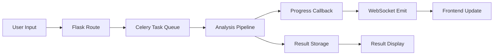

# Web Interface Implementation Plan
## Transcript Analysis Tool Browser Interface

**Document Version:** 1.0  
**Date:** 2025-01-05  
**Status:** Planning Phase

---

## 1. Executive Summary

This document outlines the plan to transform the existing command-line Transcript Analysis Tool into a web-based application with a browser interface. The goal is to maintain all existing analytical capabilities while providing an intuitive, visual interface for uploading transcripts, monitoring analysis progress, viewing intermediate results, and accessing final reports.

### Key Objectives
- Provide browser-based access to the transcript analysis pipeline
- Enable real-time progress monitoring of all analyzers
- Display intermediate and final results in an organized, accessible format
- Maintain the existing two-stage parallel processing architecture
- Preserve all current analysis capabilities and outputs

---

## 2. Current State Analysis

### Existing Architecture
- **Input:** Command-line interface accepting markdown transcript files
- **Processing:** Two-stage parallel pipeline
  - Stage A: 4 transcript analyzers (Say-Means, Perspective-Perception, Premises-Assertions, Postulate-Theorem)
  - Stage B: 4 results analyzers (Competing Hypotheses, First Principles, Determining Factors, Patentability)
  - Final: Meeting Notes synthesis and Composite Report generation
- **Output:** Markdown files saved to disk with dated filenames
- **Configuration:** Environment variables and YAML configuration

### Technical Stack
- Python-based backend
- Pydantic for data models
- OpenAI/LLM integration
- Async processing with asyncio
- Click for CLI

---

## 3. Proposed Web Architecture

### 3.1 Technology Stack

#### Backend
- **Framework:** Flask (lightweight, Python-native)
- **Async Processing:** Celery with Redis for background tasks
- **WebSocket:** Flask-SocketIO for real-time updates
- **Session Management:** Flask-Session with Redis backend
- **API:** RESTful endpoints for data exchange

#### Frontend
- **Framework:** Vanilla JavaScript with modern ES6+
- **UI Library:** Bootstrap 5 for responsive design
- **Markdown Rendering:** Marked.js or markdown-it
- **Progress Visualization:** Chart.js or custom progress bars
- **File Upload:** Dropzone.js or native HTML5

#### Infrastructure
- **Development:** Local Flask development server
- **Production Options:** 
  - Gunicorn + Nginx
  - Docker containerization
  - Optional cloud deployment (AWS, Azure, GCP)

### 3.2 Application Structure

```
transcript-analyzer-web/
├── app.py                      # Main Flask application
├── config.py                   # Web app configuration
├── requirements-web.txt        # Additional web dependencies
├── web/
│   ├── __init__.py
│   ├── routes/
│   │   ├── __init__.py
│   │   ├── upload.py          # Upload endpoints
│   │   ├── analysis.py        # Analysis control endpoints
│   │   └── results.py         # Results retrieval endpoints
│   ├── tasks/
│   │   ├── __init__.py
│   │   └── analysis_tasks.py  # Celery background tasks
│   ├── utils/
│   │   ├── __init__.py
│   │   ├── progress.py        # Progress tracking utilities
│   │   └── storage.py         # Result storage management
│   └── websocket/
│       ├── __init__.py
│       └── events.py          # WebSocket event handlers
├── static/
│   ├── css/
│   │   ├── main.css
│   │   └── components.css
│   ├── js/
│   │   ├── app.js            # Main application logic
│   │   ├── upload.js          # Upload handling
│   │   ├── progress.js        # Progress monitoring
│   │   └── results.js         # Results display
│   └── img/
├── templates/
│   ├── base.html              # Base template
│   ├── index.html             # Main interface
│   ├── components/
│   │   ├── upload.html        # Upload component
│   │   ├── progress.html      # Progress display
│   │   └── results.html       # Results viewer
│   └── partials/
│       ├── analyzer_result.html
│       └── meeting_notes.html
└── tests/
    ├── test_web_routes.py
    └── test_integration.py
```

---

## 4. User Interface Design

### 4.1 Main Interface Layout

```
┌─────────────────────────────────────────────────────────┐
│                    Header/Navigation                     │
├─────────────────────────────────────────────────────────┤
│                                                          │
│  ┌──────────────────────────────────────────────────┐  │
│  │              Input Section                        │  │
│  │  [Upload File]  OR  [Text Input Area]            │  │
│  │                                                   │  │
│  │  Configuration: [▼ Model] [▼ Verbosity]          │  │
│  │                                                   │  │
│  │              [Analyze Transcript]                 │  │
│  └──────────────────────────────────────────────────┘  │
│                                                          │
│  ┌──────────────────────────────────────────────────┐  │
│  │              Progress Section                     │  │
│  │                                                   │  │
│  │  Stage A:  [████████░░] 75%                      │  │
│  │  ├─ Say-Means            ✓                       │  │
│  │  ├─ Perspective          ✓                       │  │
│  │  ├─ Premises             ⟳ Processing...         │  │
│  │  └─ Postulate            ○ Pending               │  │
│  │                                                   │  │
│  │  Stage B:  [░░░░░░░░░░] 0%                      │  │
│  │  ├─ Competing Hypotheses ○ Waiting               │  │
│  │  ├─ First Principles     ○ Waiting               │  │
│  │  ├─ Determining Factors  ○ Waiting               │  │
│  │  └─ Patentability        ○ Waiting               │  │
│  └──────────────────────────────────────────────────┘  │
│                                                          │
│  ┌──────────────────────────────────────────────────┐  │
│  │              Results Section                      │  │
│  │                                                   │  │
│  │  [Stage A] [Stage B] [Meeting Notes] [Composite]  │  │
│  │  ┌──────────────────────────────────────────┐    │  │
│  │  │         (Selected Result Display)         │    │  │
│  │  │                                           │    │  │
│  │  │  Formatted markdown content here...       │    │  │
│  │  │                                           │    │  │
│  │  │  [Download] [Copy] [Export JSON]          │    │  │
│  │  └──────────────────────────────────────────┘    │  │
│  └──────────────────────────────────────────────────┘  │
│                                                          │
└─────────────────────────────────────────────────────────┘
```

### 4.2 User Flow

1. **Upload/Input Phase**
   - User uploads file OR pastes text
   - Optional: Configure analysis settings
   - Click "Analyze Transcript"

2. **Processing Phase**
   - Real-time progress indicators show each analyzer's status
   - Stage A completes before Stage B begins
   - Users can click completed analyzers to preview results

3. **Results Phase**
   - All results available in tabbed interface
   - Meeting Notes prominently displayed
   - Export options for each result

### 4.3 Key UI Components

#### Upload Component
- Drag-and-drop file area
- Text input with syntax highlighting
- File format validation (.md, .txt)
- Character/word count display

#### Progress Component
- Visual progress bars for each stage
- Individual analyzer status indicators
- Estimated time remaining
- Error state handling

#### Results Viewer
- Tabbed navigation for different analyses
- Markdown rendering with proper formatting
- Collapsible sections for long content
- Search/filter capabilities
- Export buttons (MD, PDF, JSON)

---

## 5. Technical Implementation Details

### 5.1 Backend Integration

#### Pipeline Adaptation
```python
# Modified pipeline with progress callbacks
class WebPipeline(AnalysisPipeline):
    def __init__(self, progress_callback=None):
        super().__init__()
        self.progress_callback = progress_callback
    
    async def run_analyzer(self, analyzer_name, *args):
        if self.progress_callback:
            self.progress_callback(analyzer_name, 'started')
        
        result = await super().run_analyzer(analyzer_name, *args)
        
        if self.progress_callback:
            self.progress_callback(analyzer_name, 'completed', result)
        
        return result
```

#### WebSocket Events
```python
# Real-time progress updates
@socketio.on('start_analysis')
def handle_analysis(data):
    transcript = data['transcript']
    session_id = request.sid
    
    # Start background task
    task = analyze_transcript.apply_async(
        args=[transcript, session_id]
    )
    
    emit('analysis_started', {'task_id': task.id})

def emit_progress(session_id, analyzer, status, result=None):
    socketio.emit('progress_update', {
        'analyzer': analyzer,
        'status': status,
        'result': result.dict() if result else None
    }, room=session_id)
```

### 5.2 Frontend Implementation

#### Progress Tracking
```javascript
// WebSocket connection for real-time updates
const socket = io();

socket.on('progress_update', (data) => {
    updateAnalyzerStatus(data.analyzer, data.status);
    if (data.result) {
        storeIntermediateResult(data.analyzer, data.result);
        enableResultTab(data.analyzer);
    }
});

function updateAnalyzerStatus(analyzer, status) {
    const element = document.getElementById(`status-${analyzer}`);
    element.className = `status ${status}`;
    element.textContent = getStatusText(status);
    updateOverallProgress();
}
```

#### Results Display
```javascript
// Dynamic result rendering
function displayResult(analyzer) {
    const result = getStoredResult(analyzer);
    const container = document.getElementById('result-display');
    
    // Render markdown
    const html = marked.parse(result.raw_output);
    container.innerHTML = html;
    
    // Update active tab
    setActiveTab(analyzer);
    
    // Enable export buttons
    enableExportOptions(analyzer, result);
}
```

### 5.3 Data Flow



---

## 6. Development Phases

### Phase 1: Foundation (Week 1-2)
- [ ] Set up Flask application structure
- [ ] Create basic HTML templates
- [ ] Implement file upload and text input
- [ ] Set up Celery and Redis
- [ ] Create basic routing structure

### Phase 2: Pipeline Integration (Week 2-3)
- [ ] Adapt existing pipeline for web use
- [ ] Add progress callback system
- [ ] Implement session management
- [ ] Create result storage mechanism
- [ ] Handle error states

### Phase 3: Real-time Features (Week 3-4)
- [ ] Implement WebSocket communication
- [ ] Create progress tracking system
- [ ] Build real-time UI updates
- [ ] Add analyzer status indicators
- [ ] Test concurrent user sessions

### Phase 4: Results Display (Week 4-5)
- [ ] Build tabbed results interface
- [ ] Implement markdown rendering
- [ ] Create result navigation
- [ ] Add export functionality
- [ ] Optimize for large results

### Phase 5: UI/UX Enhancement (Week 5-6)
- [ ] Apply responsive design
- [ ] Add loading animations
- [ ] Implement error handling UI
- [ ] Create help/documentation
- [ ] Perform usability testing

### Phase 6: Testing & Deployment (Week 6-7)
- [ ] Write integration tests
- [ ] Perform load testing
- [ ] Create deployment scripts
- [ ] Write user documentation
- [ ] Prepare production configuration

---

## 7. API Endpoints

### Core Endpoints

```
POST /api/analyze
  Body: {transcript: string, config?: object}
  Response: {task_id: string, session_id: string}

GET /api/status/{task_id}
  Response: {status: string, progress: number, analyzers: object}

GET /api/result/{task_id}/{analyzer}
  Response: {analyzer: string, result: object, timestamp: string}

GET /api/results/{task_id}
  Response: {all_results: object, meeting_notes: string, composite: string}

POST /api/export/{task_id}
  Body: {format: 'md'|'json'|'pdf', analyzers?: array}
  Response: File download
```

### WebSocket Events

```
Client → Server:
  'start_analysis': {transcript: string, config: object}
  'get_result': {task_id: string, analyzer: string}
  'cancel_analysis': {task_id: string}

Server → Client:
  'analysis_started': {task_id: string}
  'progress_update': {analyzer: string, status: string, progress: number}
  'result_ready': {analyzer: string, preview: string}
  'analysis_complete': {task_id: string, summary: object}
  'error': {message: string, analyzer?: string}
```

---

## 8. Configuration Management

### Web-Specific Configuration
```python
# config.py
class WebConfig:
    # Flask settings
    SECRET_KEY = os.environ.get('SECRET_KEY', 'dev-key')
    MAX_CONTENT_LENGTH = 10 * 1024 * 1024  # 10MB max file size
    
    # Celery settings
    CELERY_BROKER_URL = os.environ.get('REDIS_URL', 'redis://localhost:6379/0')
    CELERY_RESULT_BACKEND = os.environ.get('REDIS_URL', 'redis://localhost:6379/0')
    
    # Session settings
    SESSION_TYPE = 'redis'
    SESSION_REDIS = redis.from_url(os.environ.get('REDIS_URL', 'redis://localhost:6379/1'))
    SESSION_PERMANENT = False
    SESSION_USE_SIGNER = True
    
    # Analysis settings (inherit from existing config)
    ANALYSIS_CONFIG = AppConfig.from_env()
    
    # UI settings
    RESULTS_PER_PAGE = 10
    ENABLE_EXPORT_PDF = True
    MAX_CONCURRENT_ANALYSES = 5
```

### Environment Variables
```bash
# .env.web
FLASK_APP=app.py
FLASK_ENV=development
SECRET_KEY=your-secret-key-here
REDIS_URL=redis://localhost:6379
MAX_WORKERS=4
UPLOAD_FOLDER=./uploads
RESULTS_FOLDER=./web_results
```

---

## 9. Security Considerations

### Input Validation
- File type validation (only .md, .txt)
- File size limits (configurable, default 10MB)
- Text input sanitization
- Rate limiting per session

### Session Security
- Secure session cookies
- Session timeout (30 minutes default)
- CSRF protection
- Input sanitization for XSS prevention

### Data Privacy
- Temporary file storage with automatic cleanup
- Session-isolated results
- Optional authentication for production
- No permanent storage without user consent

### API Security
- API key authentication (optional)
- Request rate limiting
- Input validation on all endpoints
- Error message sanitization

---

## 10. Performance Optimization

### Caching Strategy
- Cache LLM responses (if deterministic)
- Cache rendered markdown
- Browser-side result caching
- Redis for session data

### Scalability Considerations
- Horizontal scaling with multiple workers
- Load balancing for production
- Database for result persistence (optional)
- CDN for static assets

### Resource Management
- Automatic cleanup of old sessions
- File upload size limits
- Concurrent analysis limits
- Memory usage monitoring

---

## 11. Testing Strategy

### Unit Tests
- Route testing
- WebSocket event testing
- Progress callback testing
- Result storage testing

### Integration Tests
- Full pipeline execution
- Concurrent user simulation
- Error handling scenarios
- Export functionality

### Performance Tests
- Load testing with multiple users
- Large transcript handling
- WebSocket connection limits
- Memory usage under load

### User Acceptance Tests
- Upload functionality
- Progress tracking accuracy
- Result display correctness
- Export functionality

---

## 12. Deployment Options

### Local Development
```bash
# Start Redis
redis-server

# Start Celery worker
celery -A app.celery worker --loglevel=info

# Start Flask app
flask run --debug
```

### Production Deployment

#### Option 1: Traditional Server
- Nginx as reverse proxy
- Gunicorn as WSGI server
- Supervisor for process management
- Let's Encrypt for SSL

#### Option 2: Docker
```dockerfile
# Dockerfile
FROM python:3.9-slim
WORKDIR /app
COPY requirements.txt requirements-web.txt ./
RUN pip install -r requirements.txt -r requirements-web.txt
COPY . .
CMD ["gunicorn", "--worker-class", "eventlet", "-w", "1", "--bind", "0.0.0.0:5000", "app:app"]
```

#### Option 3: Cloud Platform
- AWS Elastic Beanstalk
- Google Cloud Run
- Azure App Service
- Heroku

---

## 13. Monitoring & Maintenance

### Logging
- Application logs (Flask)
- Analysis pipeline logs
- Error tracking (Sentry optional)
- Performance metrics

### Monitoring
- Uptime monitoring
- Response time tracking
- Resource usage alerts
- Error rate monitoring

### Maintenance Tasks
- Regular cleanup of temporary files
- Session data pruning
- Log rotation
- Security updates

---

## 14. Future Enhancements

### Version 2.0 Features
- User authentication and accounts
- Analysis history and saved results
- Batch processing multiple transcripts
- Custom analyzer configuration UI
- Collaborative analysis sharing

### Version 3.0 Features
- Real-time collaborative editing
- Custom analyzer creation interface
- API for third-party integrations
- Advanced visualization of results
- Machine learning insights from historical analyses

---

## 15. Success Metrics

### Technical Metrics
- Page load time < 2 seconds
- Analysis start time < 5 seconds
- 99.9% uptime
- Support for 100 concurrent users

### User Experience Metrics
- Task completion rate > 90%
- User satisfaction score > 4.5/5
- Average time to results < pipeline time + 10%
- Export success rate > 99%

---

## 16. Risk Assessment

### Technical Risks
- **Risk:** LLM API rate limits
  - **Mitigation:** Queue management, rate limiting
  
- **Risk:** Large transcript processing timeout
  - **Mitigation:** Chunking strategy, progress indicators

- **Risk:** WebSocket connection drops
  - **Mitigation:** Reconnection logic, result persistence

### Business Risks
- **Risk:** User data privacy concerns
  - **Mitigation:** Clear privacy policy, optional authentication

- **Risk:** Scalability costs
  - **Mitigation:** Efficient caching, usage limits

---

## 17. Documentation Requirements

### User Documentation
- Getting started guide
- Feature walkthrough
- FAQ section
- Troubleshooting guide

### Developer Documentation
- API reference
- Architecture overview
- Deployment guide
- Contributing guidelines

### Administrator Documentation
- Configuration guide
- Monitoring setup
- Backup procedures
- Security best practices

---

## Appendix A: Technology Alternatives Considered

| Component | Selected | Alternatives | Rationale |
|-----------|----------|--------------|-----------|
| Backend Framework | Flask | FastAPI, Django | Simplicity, existing Python codebase compatibility |
| Task Queue | Celery | RQ, Huey | Mature, well-documented, scalable |
| WebSocket | Flask-SocketIO | WebSockets, SSE | Easy integration with Flask |
| Frontend | Vanilla JS | React, Vue | Simplicity, no build process needed |
| CSS Framework | Bootstrap | Tailwind, Bulma | Comprehensive components, familiar |

---

## Appendix B: Estimated Timeline

| Phase | Duration | Dependencies | Deliverables |
|-------|----------|--------------|--------------|
| Planning | 1 week | Requirements gathering | This document |
| Phase 1 | 2 weeks | Environment setup | Basic web structure |
| Phase 2 | 1 week | Phase 1 | Pipeline integration |
| Phase 3 | 1 week | Phase 2 | Real-time features |
| Phase 4 | 1 week | Phase 3 | Results display |
| Phase 5 | 1 week | Phase 4 | UI polish |
| Phase 6 | 1 week | Phase 5 | Testing & deployment |
| **Total** | **8 weeks** | | **Production-ready web interface** |

---

## Document Revision History

| Version | Date | Author | Changes |
|---------|------|--------|---------|
| 1.0 | 2025-01-05 | System | Initial planning document |

---

*End of Planning Document*
